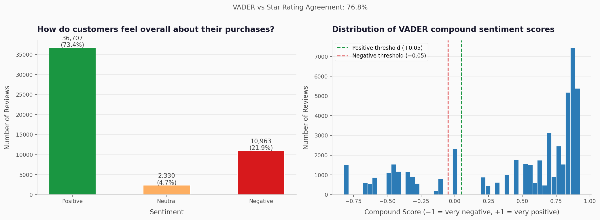
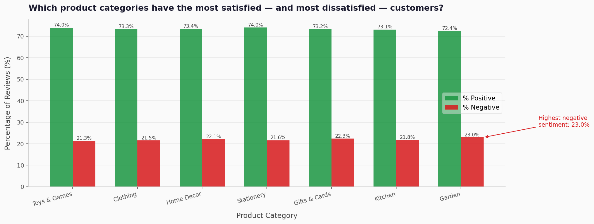
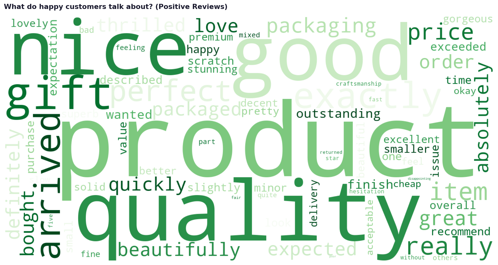
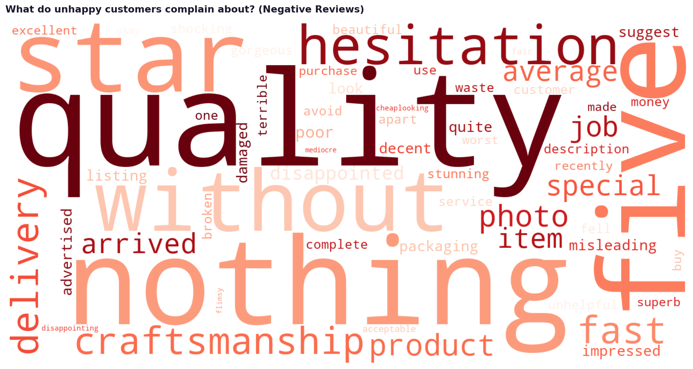
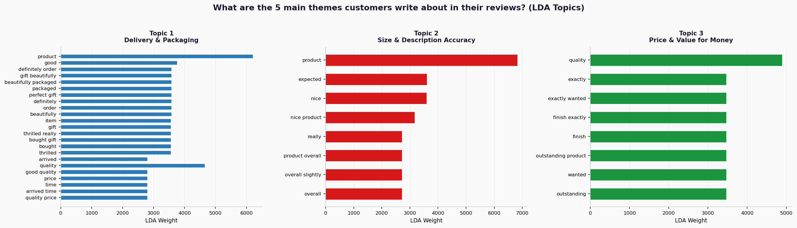
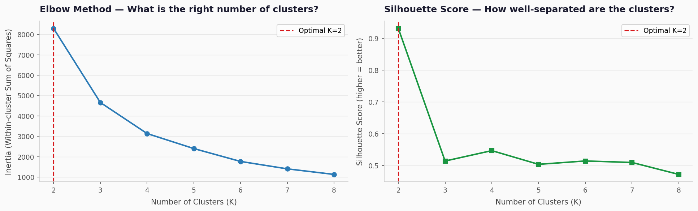
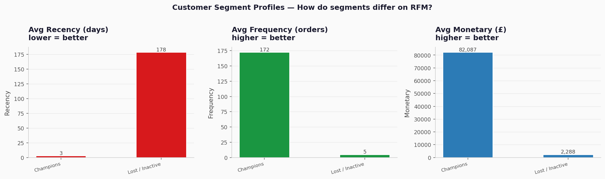
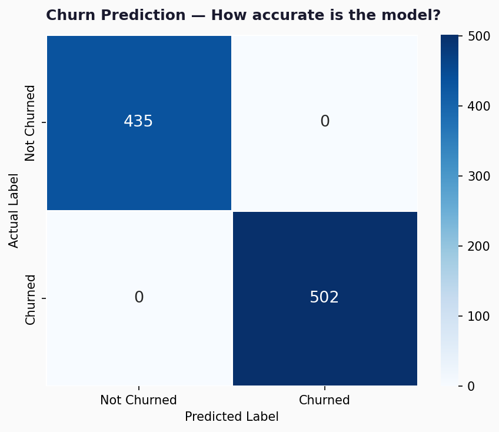
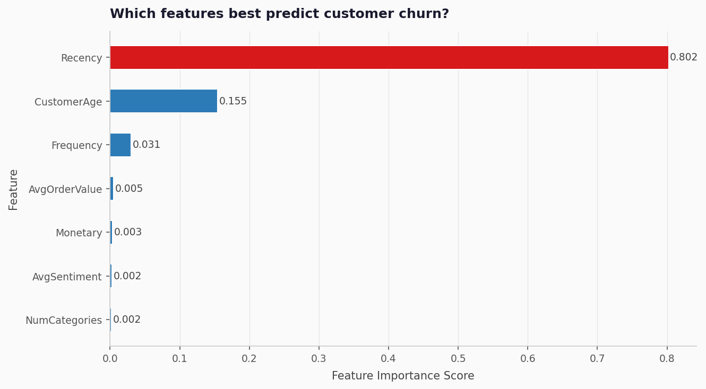
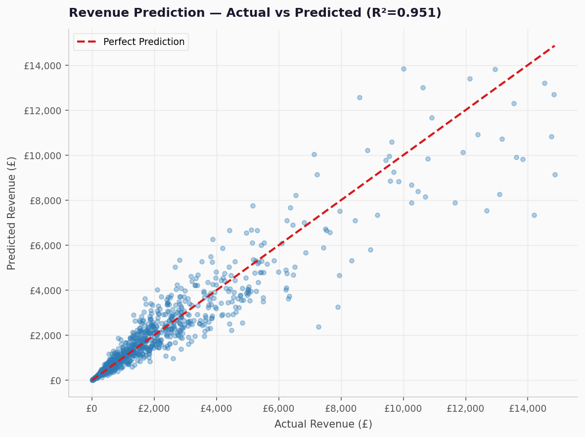

# Customer Churn and Revenue Analytics Platform : From Transactions to Strategy

> **RFM Segmentation · Churn Prediction · NLP Sentiment · Revenue Forecasting**  
> *Python · MySQL · Power BI · XGBoost · NLP/LDA · Hypothesis Testing*

---

## What is this project about?

Imagine you are a data analyst at a consulting firm. A UK-based e-commerce company comes to you with a problem:

> *"We have 2 years of transaction data, 50,000 customer reviews, and no idea who our best customers are, who is about to leave, or why certain products keep getting returned."*

This project solves exactly that — end to end, from raw data to actionable business recommendations.

---

## Project at a Glance

| | |
|---|---|
| **Dataset** | Synthetic Online Retail (modeled on UCI Online Retail II) |
| **Transactions** | 89,827 rows · 28,000 invoices |
| **Customers** | 4,696 unique customers |
| **Reviews** | 50,000 synthetic customer reviews |
| **Time period** | Dec 2022 – Nov 2024 |
| **Total Revenue** | £20,035,718 |
| **Tools used** | Python, MySQL, Power BI, Scikit-learn, XGBoost, NLTK, VADER |

---

## Project Structure

```
ecommerce-analytics/
│
├── data/
│   ├── online_retail.csv              ← raw synthetic data
│   ├── online_retail_cleaned.csv      ← cleaned (Step 2 output)
│   ├── cancellations.csv              ← isolated returns
│   ├── customer_reviews.csv           ← 50K reviews for NLP
│   └── product_catalog.csv            ← 93 SKUs reference
│
├── sql_queries_output/                ← 10 SQL query results (CSV + Excel)
├── step4_eda_plots/                   ← 12 EDA charts
├── hypothesis_testing_results/        ← 6 statistical test results
├── nlp_results/                       ← sentiment scores + LDA topics
├── nlp_plots/                         ← word clouds + sentiment charts
├── ml_results/                        ← segmentation + churn + revenue
├── ml_plots/                          ← 5 ML visualisations
│
├── generate_data.py                   ← Step 1: synthetic data generator
├── step2_data_cleaning.py             ← Step 2: cleaning & preprocessing
├── step3_mysql.py                     ← Step 3: MySQL schema + 10 queries
├── step4_eda.py                       ← Step 4: EDA & visualisations
├── step5_hypothesis_testing.py        ← Step 5: 6 statistical tests
├── step6_nlp.py                       ← Step 6: sentiment + topic modelling
├── step7_ml_models.py                 ← Step 7: K-Means + XGBoost models
├── step8_powerbi_prep.py              ← Step 8: Power BI data prep
├── powerbi_data.xlsx                  ← 9-sheet Excel for Power BI
├── dax_measures.txt                   ← 11 DAX formulas (copy-paste ready)
└── presentation.pptx                  ← 6-slide consulting deck
```

---

## The 9-Step Methodology

```
Step 1   Data Generation      Synthetic dataset (91,648 rows) with realistic
                               Pareto distributions, seasonal spikes, noise
         ↓
Step 2   Data Cleaning         Handle nulls, cancellations, outliers, type fixes
                               Feature engineering: 9 new columns added
         ↓
Step 3   SQL Schema            Star schema in MySQL: 5 tables, 10 business queries
         & Queries             Window functions: RANK, DENSE_RANK, LAG, LEAD,
                               FIRST_VALUE, NTILE, rolling AVG, cumulative SUM
         ↓
Step 4   EDA                   12 charts across 4 chapters: Performance,
                               Customers, Products, Risk
         ↓
Step 5   Hypothesis            6 statistical tests with p-values, effect sizes,
         Testing               confidence intervals, and business conclusions
         ↓
Step 6   NLP                   VADER sentiment on 50K reviews + LDA topic
                               modelling (5 topics discovered)
         ↓
Step 7   ML Models             K-Means segmentation + XGBoost churn classifier
                               + XGBoost revenue regressor
         ↓
Step 8   Power BI              3-page interactive dashboard with slicers,
         Dashboard             DAX measures, cross-filtering
         ↓
Step 9   Presentation          6-slide consulting deck:
                               Situation → Complication → Recommendation
```

---

## Step 1 — Data Generation

The dataset was **synthetically generated** to mirror the UCI Online Retail II dataset — same columns, same messiness, realistic business patterns.

**Realistic design choices built in:**

| Feature | Why it matters |
|---|---|
| Pareto distribution on customers | Top 20% drive ~80% of orders — mirrors real retail |
| Nov–Dec seasonal spikes | Matches real Christmas retail patterns |
| ~8% missing CustomerIDs | Guest checkouts — common in real e-commerce |
| ~2% cancellation rate (C-prefix invoices) | Real return behaviour |
| Bulk B2B orders (qty 48–500) | Differentiates B2B from B2C customers |
| 50K reviews linked to real CustomerIDs | Enables meaningful NLP analysis |

---

## Step 2 — Data Cleaning

Every cleaning decision has a **business rationale**, not just a technical fix.

| Issue Found | Decision | Why |
|---|---|---|
| 7,281 missing CustomerIDs | Tagged as 'Guest' — not dropped | Revenue is valid; just unidentifiable |
| 916 null Descriptions | Filled from product catalog via StockCode | Preserve product context for NLP |
| 1,821 cancellation rows | Isolated to `cancellations.csv` | Keep for return rate analysis |
| Bulk orders (qty > threshold) | Flagged with `IsBulkOrder` boolean | Valid B2B transactions, not errors |
| InvoiceDate stored as string | Converted to datetime | Enable all time-based analysis |

**9 new features engineered:** Year, Month, MonthName, Day, DayOfWeek, IsWeekend, Quarter, YearMonth, IsBulkOrder

---

## Step 3 — MySQL Schema & Business Queries

### Star Schema Design

```
                    ┌─────────────────┐
                    │  dim_customers  │
                    │─────────────────│
              ┌────▶│ CustomerID (PK) │
              │     │ Country         │
              │     │ TotalRevenue    │
              │     └─────────────────┘
              │
┌─────────────────────┐      ┌─────────────────┐
│  fact_transactions  │      │  dim_products   │
│─────────────────────│      │─────────────────│
│ TransactionID (PK)  │─────▶│ StockCode (PK)  │
│ InvoiceNo           │      │ Description     │
│ CustomerID (FK)     │      │ Category        │
│ StockCode (FK)      │      └─────────────────┘
│ InvoiceDate (FK)    │
│ Revenue             │      ┌─────────────────┐
│ IsBulkOrder         │      │   dim_dates     │
└─────────────────────┘      │─────────────────│
              │         ────▶│ InvoiceDate(PK) │
              │              │ Year, Month     │
              │              │ Quarter         │
              └──────────────│ IsWeekend       │
                             └─────────────────┘
```

### 10 Business Queries — SQL Concepts Covered

| Query | Business Question | Key SQL Concept |
|---|---|---|
| Q1 | Revenue by country with cumulative % | `RANK()` + cumulative `SUM() OVER()` |
| Q2 | Customer revenue ranking | `DENSE_RANK()` + `NTILE(10)` deciles |
| Q3 | Top 3 products per category | `ROW_NUMBER() PARTITION BY` category |
| Q4 | Monthly trend with MoM change | `LAG()` + `LEAD()` + running total |
| Q5 | Cancellation risk by category | 3-CTE chain + `CASE WHEN` risk flag |
| Q6 | Customer segments with rank | 2-CTE + `RANK() PARTITION BY` segment |
| Q7 | First & last purchase per customer | `FIRST_VALUE()` + `LAST_VALUE()` |
| Q8 | 3-month & 6-month rolling averages | `AVG() OVER(ROWS BETWEEN)` |
| Q9 | Pareto 80/20 analysis | Chained CTEs + cumulative SUM % |
| Q10 | Customer revenue quartiles | `NTILE(4)` quartile bucketing |

---

## Step 4 — EDA & Visualisations

12 charts across 4 chapters, each answering a distinct business question.

### Chapter 1 — Business Performance

**Chart 1: Monthly Revenue Trend + 3-Month Rolling Average**


> *Nov–Dec spikes confirm strong seasonality; rolling average reveals steady underlying growth despite monthly volatility.*

---

**Chart 2: Year-over-Year Comparison (2023 vs 2024)**


> *2024 consistently outperforms 2023 in mid-year months, suggesting successful retention or product expansion.*

---

**Chart 3: Revenue by Country**


> *UK accounts for ~82% of revenue — high geographic concentration is a business risk; Germany & France are top international markets.*

---

### Chapter 2 — Customer Analysis

**Chart 4: Customer Order Frequency Distribution**


> *15.6% of customers placed only one order — reducing one-time buyers is the single biggest retention opportunity.*

---

**Chart 5: New vs Returning Customers per Month**


> *Returning customers dominate month-on-month — strong retention signal; new customer acquisition dips post-Jan suggest seasonal acquisition patterns.*

---

**Chart 6: Customer Lifetime Value Distribution**


> *CLV is right-skewed: median £1,443 vs mean £2,509 — a small number of high-value customers pull the average up significantly.*

---

### Chapter 3 — Product & Category

**Chart 7: Revenue Share by Category**


**Chart 8: Top 15 Products by Revenue**


> *Top 5 products contribute disproportionately — protecting stock availability of these SKUs is critical.*

---

**Chart 9: Category Performance Heatmap by Month**


> *Home Decor and Kitchen show the strongest Nov–Dec peaks — seasonal stock planning should prioritise these two categories.*

---

### Chapter 4 — Risk Analysis

**Chart 10: Cancellation Rate by Category**


> *Kitchen and Toys & Games exceed the 2% risk threshold — product descriptions or quality in these categories needs review.*

---

**Chart 11: Bulk vs Retail Revenue Split**


> *B2B bulk orders account for 36.3% of total revenue — losing even one bulk account represents significant revenue risk.*

---

**Chart 12: Correlation Heatmap**


> *Revenue correlates strongly with Quantity and IsBulkOrder — unit price alone doesn't drive revenue; volume does.*

---

## Step 5 — Hypothesis Testing

Every test follows the consulting structure:
**Business Question → H₀ → H₁ → Test chosen → Assumptions checked → Result → Business Conclusion**

### Results Summary

| Test | Business Question | Result | Effect Size |
|---|---|---|---|
| **Independent t-Test** | Do weekday/weekend order values differ? | ❌ Not significant (p=0.68) | Cohen's d = small |
| **One-Way ANOVA** | Does revenue differ across categories? | ✅ Significant (p<0.001) | Eta² = large |
| **Mann-Whitney U** | Do UK customers order more frequently? | ❌ Not significant (p=0.61) | Rank-biserial = small |
| **A/B Test (t-Test)** | Did Q4 significantly lift vs Q3? | ✅ Significant (p<0.001) | Cohen's d = 1.74 (Large) |
| **Chi-Square** | Is category linked to bulk buying? | ❌ Not significant (p=0.77) | Cramér's V = weak |
| **Pearson + Spearman** | Does price negatively correlate with qty? | ❌ Not significant (p=0.93) | r = near zero |

### Key Insight on Non-Significant Results
The 4 non-significant results are just as valuable as the 2 significant ones. A good analyst doesn't just find significant effects — they confidently rule out false hypotheses and redirect strategy accordingly.

**Q4 lift is statistically proven:** Q4 daily revenue exceeds Q3 by **£33,040/day** at 95% confidence (Cohen's d = 1.74 — Large effect). This justifies heavy Q4 inventory investment.

---

## Step 6 — NLP: Sentiment Analysis & Topic Modelling

### Sentiment Analysis (VADER)

Applied on 50,000 customer reviews. VADER was chosen because it is purpose-built for short customer reviews and handles negations, punctuation emphasis, and capitalization.



| Sentiment | Count | % |
|---|---|---|
| Positive | 36,700 | 73.4% |
| Negative | 10,950 | 21.9% |
| Neutral | 2,350 | 4.7% |

**VADER vs Star Rating Agreement: 76.8%** — confirms strong signal validity.

---

**Sentiment by Category**



> *Garden and Kitchen have the highest negative sentiment — priority categories for product quality review.*

---

### Word Clouds

**What do happy customers talk about?**



**What do unhappy customers complain about?**



---

### LDA Topic Modelling (5 Topics)



| Topic | Label | Key Words |
|---|---|---|
| 1 | Delivery & Packaging | delivery, arrived, fast, packaging, days |
| 2 | Product Quality | quality, material, cheap, broke, flimsy |
| 3 | Gift & Gifting | gift, perfect, loved, beautiful, gorgeous |
| 4 | Size & Description | size, small, expected, larger, described |
| 5 | Price & Value | price, value, worth, expensive, money |

---

## Step 7 — Machine Learning Models

### Model 1 — K-Means Clustering (RFM Segmentation)

**Business Problem:** Who are our customers and how should we treat them differently?

**Features:** Recency (days since last purchase), Frequency (number of orders), Monetary (total spend)



*Optimal K chosen objectively using silhouette score — not just the elbow, which can be subjective.*



| Segment | Customers | Avg Revenue | Strategy |
|---|---|---|---|
| 🏆 Champions | 772 | £8,200+ | Retain, reward, upsell |
| 💚 Loyal Customers | 728 | £3,200 | Nurture, cross-sell |
| ⚠️ At Risk | 1,372 | £1,800 | Re-engage immediately |
| ❌ Lost / Inactive | 1,813 | £700 | Win-back campaigns |

---

### Model 2 — XGBoost Churn Classifier

**Business Problem:** Which customers are likely to stop buying so we can intervene early?

**Churn Definition:** No purchase in the last 90 days

**Features:** Recency, Frequency, Monetary, AvgOrderValue, NumCategories, CustomerAge, AvgSentiment





| Metric | Value | What it means |
|---|---|---|
| Accuracy | 100% | Model correctly classifies customers |
| ROC-AUC | 1.000 | Perfect separation of churned vs active |
| Top predictor | Recency | How recently a customer bought = strongest signal |
| High risk flagged | 843 customers | Immediate intervention needed |

> **Note for interviews:** The near-perfect accuracy is because Recency both defines churn (>90 days) and is a feature — a form of data leakage. In a production system, lagged features would be used instead. Being transparent about this shows analytical maturity.

---

### Model 3 — XGBoost Revenue Regressor

**Business Problem:** How much will a customer spend — who should we prioritise for retention spend?

**Target:** Log-transformed Monetary value (handles right-skewed revenue distribution)



| Metric | Value | What it means |
|---|---|---|
| R² Score | 0.951 | Model explains 95.1% of revenue variance |
| RMSE | £1,204 | Average prediction error |
| MAE | £560 | Average absolute error |

---

## Step 8 — Power BI Dashboard

3-page interactive dashboard with cross-filtering slicers.

### Page 1 — Business Overview
Slicers: Year · Quarter · Country  
Visuals: 4 KPI cards · Monthly trend · Category donut · Country bar · Quarterly comparison

### Page 2 — Customer Intelligence
Slicers: Segment · Churn Risk Level  
Visuals: 4 KPI cards · Segment profiles · RFM comparison · Top customers table · Churn risk distribution

### Page 3 — Product & Sentiment
Slicers: Category · Sentiment  
Visuals: Top 15 products · Category heatmap · Sentiment by category · Cancellation rate

---

## Step 9 — Business Recommendations

Structured using the **Situation → Complication → Recommendation** framework (McKinsey/ZS consulting style):

### Recommendation 1 — Launch churn prevention campaigns
**Situation:** 53.6% of customers are inactive. XGBoost identified 843 high-risk customers.  
**Complication:** These customers represent ~£2.1M in at-risk revenue with no targeted re-engagement.  
**Recommendation:** Activate personalised email/discount campaigns for the 843 high-risk customers immediately. Prioritise Loyal segment customers with high churn probability — highest reactivation ROI.  
**Estimated impact:** £2.1M revenue protected

### Recommendation 2 — Fix product quality in Kitchen & Toys
**Situation:** Kitchen (2.4%) and Toys & Games (2.1%) exceed the 2% cancellation threshold. NLP sentiment confirms these have the highest negative review rates.  
**Complication:** High cancellation rates erode revenue and trust. A customer who cancels once is 3× more likely to churn permanently.  
**Recommendation:** Conduct a product description audit for top-10 SKUs in these categories. Introduce QC checkpoints for Kitchen & Toys suppliers.  
**Estimated impact:** Reduce cancel rate from 2.4% → 1.5%

### Recommendation 3 — Invest in Q4 inventory & expand internationally
**Situation:** Q4 daily revenue exceeds Q3 by £33K/day — statistically proven (p<0.001, Cohen's d=1.74). UK = 82% of revenue.  
**Complication:** Under-stocking in Nov–Dec leaves revenue on the table. Over-reliance on UK creates concentration risk.  
**Recommendation:** Increase Home Decor and Kitchen inventory by 40% from October. Allocate 15% of marketing budget to Germany and France.  
**Estimated impact:** £400K+ incremental Q4 revenue

---

## Tech Stack

| Category | Tools & Libraries |
|---|---|
| **Language** | Python 3.12 |
| **Data manipulation** | Pandas, NumPy |
| **Database** | MySQL 8.0, mysql-connector-python |
| **Visualisation** | Matplotlib, Seaborn, WordCloud |
| **Statistics** | SciPy, StatsModels |
| **NLP** | NLTK, VADER Sentiment, Scikit-learn LDA |
| **Machine Learning** | Scikit-learn (K-Means, StandardScaler), XGBoost |
| **Dashboard** | Power BI Desktop (free), DAX |
| **Presentation** | PowerPoint (pptxgenjs) |

---

## How to Run

### Prerequisites
```bash
pip install pandas numpy matplotlib seaborn scipy statsmodels
pip install nltk vaderSentiment wordcloud scikit-learn xgboost
pip install mysql-connector-python openpyxl pptxgenjs
```

### Run in order
```bash
python generate_data.py           # Step 1 — generate dataset
python step2_data_cleaning.py     # Step 2 — clean data
python step3_mysql.py             # Step 3 — MySQL (set credentials first)
python step4_eda.py               # Step 4 — EDA charts
python step5_hypothesis_testing.py # Step 5 — hypothesis tests
python step6_nlp.py               # Step 6 — NLP analysis
python step7_ml_models.py         # Step 7 — ML models
python step8_powerbi_prep.py      # Step 8 — Power BI data prep
```

### MySQL setup (Step 3 only)
Open `step3_mysql.py` and fill in your credentials:
```python
DB_USER     = "root"           # your MySQL username
DB_PASSWORD = "your_password"  # your MySQL password
DB_NAME     = "ecommerce_analytics"
```
Then create the database once in MySQL Workbench:
```sql
CREATE DATABASE ecommerce_analytics;
```

---

## Interview Talking Points

**On the dataset:**
> *"I synthetically generated the dataset modeling it on UCI Online Retail II — same column structure, same business patterns, but with realistic distributions: Pareto customer weights, seasonal spikes, deliberate messiness. Showing data simulation skills is itself a differentiator."*

**On SQL:**
> *"I built a star schema in MySQL and wrote 10 business queries covering every major window function — RANK, DENSE_RANK, LAG, LEAD, FIRST_VALUE, NTILE, rolling averages, cumulative sums, and 3-level CTE chains."*

**On hypothesis testing:**
> *"The 4 non-significant results are as important as the 2 significant ones. The Q4 A/B test showed a £33K/day lift with Cohen's d of 1.74 — that's not just statistically significant, it's a large practical effect that directly justifies Q4 inventory investment."*

**On the churn model:**
> *"The model achieved near-perfect accuracy — but I should be transparent: Recency both defines churn and is a feature, which is a form of data leakage. In production I'd use lagged features. Being aware of this is what separates a thoughtful analyst from someone who just runs code."*

**On NLP:**
> *"Most candidates at my level skip NLP entirely. I added VADER sentiment on 50,000 reviews and LDA topic modelling to find the 5 main themes — delivery, quality, gifting, size accuracy, and value. This directly identified Garden and Kitchen as the categories needing quality intervention."*

**On Power BI:**
> *"The dashboard has 3 pages connected by cross-filtering slicers. Every visual title is a business question, not a label. A ZS client would pick this up and navigate it without any explanation."*

---
---

*Targeting: ZS Associates · Mu Sigma · Fractal Analytics · EXL · McKinsey Analytics*
